# Heating Oil Monitor Integration - Complete Documentation

## Table of Contents

1. [Overview](#overview)
2. [Features](#features)
3. [Installation](#installation)
4. [Configuration](#configuration)
5. [Advanced Settings](#advanced-settings)
6. [Sensors](#sensors)
7. [Temperature Compensation](#temperature-compensation)
8. [Architecture](#architecture)
9. [Volume Calculation](#volume-calculation)
10. [Services](#services)
11. [Troubleshooting](#troubleshooting)
12. [Technical Reference](#technical-reference)

---

## Overview

The Heating Oil Monitor is a custom Home Assistant integration designed to track and monitor heating oil consumption in horizontal cylindrical tanks. It provides real-time volume monitoring, consumption tracking, refill detection, and advanced temperature compensation for outdoor installations.

### Key Capabilities

- **Accurate Volume Calculation**: Uses circular segment geometry for horizontal cylindrical tanks
- **Consumption Tracking**: Daily, monthly, and historical consumption monitoring
- **Automatic Refill Detection**: Identifies tank refills automatically
- **Temperature Compensation**: Accounts for thermal expansion in outdoor tanks
- **Predictive Analytics**: Estimates days until tank is empty
- **Energy Conversion**: Tracks consumption in both volume (liters) and energy (kWh)

---

## Features

### 📊 Volume Monitoring

- Real-time tank volume calculation
- Temperature-normalized volume (optional)
- Configurable tank dimensions

### 📈 Consumption Tracking

- Daily consumption (since midnight)
- Monthly consumption (since 1st of month)
- Energy consumption in kWh
- Historical data restoration from Home Assistant recorder

### 🔔 Smart Detection

- Automatic refill detection with configurable threshold
- Noise filtering for small fluctuations
- Temperature-based volume correction

### 🌡️ Temperature Compensation

- Optional external temperature sensor support
- Compensates for thermal expansion/contraction
- Configurable reference temperature
- Shows both measured and normalized volumes

### 🔮 Predictive Features

- Days until empty estimation
- Average consumption calculation
- Refill history tracking

---

## Installation

### Method 1: Manual Installation

1. Copy the `custom_components/heating_oil_monitor` directory to your Home Assistant's `custom_components` directory:

   ```
   /config/custom_components/heating_oil_monitor/
   ```

2. Restart Home Assistant

3. Navigate to **Settings** → **Devices & Services** → **Add Integration**

4. Search for "Heating Oil Monitor"

### Method 2: HACS (Future)

_Note: This integration is not yet available in HACS_

### Prerequisites

- Home Assistant 2023.1 or newer
- An air gap sensor (ultrasonic distance sensor) measuring the distance from the top of the tank to the oil surface
- (Optional) Temperature sensor for outdoor tanks

---

## Configuration

### Initial Setup

1. Go to **Settings** → **Devices & Services**
2. Click **+ Add Integration**
3. Search for "Heating Oil Monitor"
4. Fill in the configuration form:

### Configuration Parameters

#### Required Settings

| Parameter          | Description                                  | Example                    | Unit |
| ------------------ | -------------------------------------------- | -------------------------- | ---- |
| **Air Gap Sensor** | Entity ID of your ultrasonic distance sensor | `sensor.oil_tank_distance` | -    |
| **Tank Diameter**  | Interior diameter of the tank                | `150`                      | cm   |
| **Tank Length**    | Interior length of the tank                  | `200`                      | cm   |

#### Optional Settings

| Parameter                        | Description                                         | Default | Unit     |
| -------------------------------- | --------------------------------------------------- | ------- | -------- |
| **Refill Threshold**             | Minimum volume increase to detect refill            | `100`   | L        |
| **Noise Threshold**              | Small volume fluctuations to ignore                 | `2`     | L        |
| **Consumption Days**             | Period for consumption averaging                    | `7`     | days     |
| **Temperature Sensor**           | External temperature sensor                         | None    | -        |
| **Reference Temperature**        | Baseline for volume normalization                   | `15`    | °C       |
| **Refill Stabilization Minutes** | Time to wait for readings to stabilize after refill | `60`    | min      |
| **Refill Stability Threshold**   | Max variance to consider readings stable            | `5`     | L        |
| **Reading Buffer Size**          | Number of readings for median filter                | `5`     | readings |
| **Reading Debounce Seconds**     | Minimum time between processing readings            | `60`    | sec      |

### Configuration Examples

#### Basic Configuration (Indoor Tank)

```yaml
Air Gap Sensor: sensor.oil_tank_ultrasonic
Tank Diameter: 150 cm
Tank Length: 200 cm
Refill Threshold: 100 L
```

#### Advanced Configuration (Outdoor Tank)

```yaml
Air Gap Sensor: sensor.oil_tank_ultrasonic
Tank Diameter: 150 cm
Tank Length: 200 cm
Refill Threshold: 100 L
Noise Threshold: 2 L
Consumption Days: 14 days
Temperature Sensor: sensor.outdoor_temperature
Reference Temperature: 15 °C
Refill Stabilization Minutes: 60 min
Refill Stability Threshold: 5 L
Reading Buffer Size: 5
Reading Debounce Seconds: 60 sec
```

---

## Advanced Settings

### Refill Stabilization

During tank refills, readings can fluctuate as oil sloshes and settles. The refill stabilization feature:

1. **Detects refill start** - When volume increases significantly
2. **Buffers readings** - Collects readings during the stabilization window
3. **Waits for stability** - Monitors until readings stabilize within threshold
4. **Confirms refill** - Records final volume after stabilization

**Configuration Parameters**:

| Parameter                        | Description                                                             | Default |
| -------------------------------- | ----------------------------------------------------------------------- | ------- |
| **Refill Stabilization Minutes** | Maximum time to wait for readings to stabilize after detecting a refill | 60 min  |
| **Refill Stability Threshold**   | Maximum variance between readings to consider the tank stable           | 5 L     |

**Example**: If you notice refill volumes are incorrect because readings fluctuate during delivery, increase the stabilization time or decrease the stability threshold.

### Reading Filter (Median Filter with Debouncing)

The integration includes a median filter to smooth out sensor noise and prevent false readings from affecting consumption calculations.

**How it works**:

1. **Buffer readings** - Keeps a rolling buffer of recent air gap measurements
2. **Apply median filter** - Uses the median value to reject outliers
3. **Debounce** - Ignores readings that arrive too quickly after the last processed reading

**Configuration Parameters**:

| Parameter                    | Description                                            | Default |
| ---------------------------- | ------------------------------------------------------ | ------- |
| **Reading Buffer Size**      | Number of readings to keep in the median filter buffer | 5       |
| **Reading Debounce Seconds** | Minimum time between processing consecutive readings   | 60 sec  |

**When to adjust**:

- **Noisy sensor**: Increase buffer size (e.g., 7-10) for more aggressive filtering
- **Slow sensor**: Decrease buffer size (e.g., 3) to be more responsive
- **Fast-updating sensor**: Increase debounce time to reduce processing
- **Slow-updating sensor**: Decrease debounce time to capture all readings

---

## Sensors

The integration creates the following sensors:

### 1. Heating Oil Volume

- **Entity ID**: `sensor.heating_oil_volume`
- **Unit**: Liters (L)
- **Description**: Current oil volume in tank (measured/geometric)
- **Updates**: When air gap sensor changes

### 2. Heating Oil Normalized Volume

- **Entity ID**: `sensor.heating_oil_normalized_volume`
- **Unit**: Liters (L)
- **Description**: Temperature-compensated volume at reference temperature
- **Updates**: When air gap or temperature changes
- **Only available**: When temperature sensor is configured

**Attributes**:

- `measured_volume`: Raw volume from geometric calculation
- `current_temperature`: Current oil temperature
- `reference_temperature`: Target normalization temperature
- `temperature_difference`: Temp deviation from reference
- `volume_correction`: Liters adjusted for temperature
- `thermal_expansion_coefficient`: 0.00095 per °C

### 3. Heating Oil Daily Consumption

- **Entity ID**: `sensor.heating_oil_daily_consumption`
- **Unit**: Liters (L)
- **Description**: Oil consumed since midnight today
- **Resets**: Daily at midnight

**Attributes**:

- `period_start`: Start of current day
- `period_type`: "today"

### 4. Heating Oil Daily Energy Consumption

- **Entity ID**: `sensor.heating_oil_daily_consumption_kwh`
- **Unit**: Kilowatt-hours (kWh)
- **Description**: Energy equivalent of daily consumption
- **Conversion**: 10 kWh per liter of kerosene

**Attributes**:

- `conversion_factor`: "10 kWh/L"
- `daily_consumption_liters`: Volume in liters

### 5. Heating Oil Monthly Consumption

- **Entity ID**: `sensor.heating_oil_monthly_consumption`
- **Unit**: Liters (L)
- **Description**: Oil consumed since 1st of current month
- **Resets**: Monthly on 1st

**Attributes**:

- `period_start`: Start of current month
- `period_type`: "current_month"

### 6. Heating Oil Days Until Empty

- **Entity ID**: `sensor.heating_oil_days_until_empty`
- **Unit**: Days
- **Description**: Estimated days until tank is empty based on recent consumption
- **Calculation**: Current volume ÷ average daily consumption

**Attributes**:

- `calculation_period_days`: Number of days used for averaging
- `average_daily_consumption`: Average consumption per day
- `days_of_data`: Actual days of data available
- `status`: "Live calculation" or "Using last calculated value"

### 7. Heating Oil Last Refill

- **Entity ID**: `sensor.heating_oil_last_refill`
- **Device Class**: Timestamp
- **Description**: Date and time of last detected refill

### 8. Heating Oil Last Refill Volume

- **Entity ID**: `sensor.heating_oil_last_refill_volume`
- **Unit**: Liters (L)
- **Description**: Volume added in last refill

**Attributes**:

- `last_refill_date`: ISO timestamp of last refill
- `refill_count`: Number of refills in history
- `total_refilled`: Total volume refilled in past 12 months

---

## Temperature Compensation

### Why Temperature Compensation?

Heating oil expands and contracts with temperature at approximately **0.095% per °C**. For outdoor tanks experiencing temperature swings, this can cause significant apparent volume changes that are not actual consumption.

### Real-World Impact

| Tank Size | Temperature Change | Apparent Volume Change |
| --------- | ------------------ | ---------------------- |
| 1000 L    | ±10°C              | ±9.5 L                 |
| 2000 L    | ±10°C              | ±19 L                  |
| 1000 L    | ±20°C              | ±19 L                  |
| 2000 L    | ±20°C              | ±38 L                  |

### How It Works


### Formula

The normalized volume is calculated as:

```
V_normalized = V_measured / (1 + α × ΔT)

Where:
- V_measured = Volume from geometric calculation
- α = 0.00095 (thermal expansion coefficient for kerosene)
- ΔT = Current temperature - Reference temperature
```

### Example

**Scenario**: Outdoor tank on a cold winter day

- **Measured Volume**: 1500 L (geometric calculation from air gap)
- **Current Temperature**: -5°C
- **Reference Temperature**: 15°C
- **Temperature Difference**: -20°C

**Calculation**:

```
Correction Factor = 1 + (0.00095 × -20) = 1 - 0.019 = 0.981
Normalized Volume = 1500 / 0.981 ≈ 1529 L
```

**Result**: The oil has physically contracted by ~29 L due to cold. The normalized volume (1529 L) represents the actual quantity of fuel you have, showing you have MORE fuel than the geometric measurement indicates.

### When to Use Temperature Compensation

✅ **Use temperature compensation when**:

- Tank is outdoors or in an unheated space
- Temperature swings exceed 10°C
- You need precision better than ±10-20L
- You're seeing unexplained volume fluctuations

❌ **Skip temperature compensation when**:

- Tank is in climate-controlled space
- Temperature is relatively stable
- Precision requirements are modest

---

## Architecture

### System Overview


### Data Flow

```mermaid
sequenceDiagram
    participant AG as Air Gap Sensor
    participant TC as Temperature Sensor
    participant CO as Coordinator
    participant VC as Volume Calculator
    participant TM as Temp Compensation
    participant CD as Consumption Detector
    participant SE as Sensors

    AG->>CO: Air gap changed (e.g., 45cm)
    CO->>VC: Calculate volume(45cm, 150cm, 200cm)
    VC->>CO: Return 1500L

    opt Temperature sensor configured
        TC->>CO: Temperature changed (e.g., -5°C)
        CO->>TM: Normalize(1500L, -5°C, 15°C)
        TM->>CO: Return 1529L
    end

    CO->>CD: Process volume change

    alt Volume increased > threshold
        CD->>CO: Refill detected
        CO->>SE: Update refill sensors
    else Volume decreased
        CD->>CO: Consumption recorded
        CO->>SE: Update consumption sensors
    else Small change < noise threshold
        CD->>CO: Ignore (noise)
    end

    CO->>SE: Notify all sensors
    SE->>SE: Update states
```



### State Machine - Refill Detection


---

## Volume Calculation

### Horizontal Cylindrical Tank Geometry

The integration uses the **circular segment formula** to calculate volume in a horizontal cylindrical tank.


### Mathematical Formula

For a horizontal cylindrical tank with liquid height `h` from the bottom:

**Circular Segment Area**:

```
A = r² × arccos((r - h) / r) - (r - h) × √(2rh - h²)

Where:
- r = radius (diameter / 2)
- h = liquid_height (diameter - air_gap)
```

**Volume**:

```
V = A × L / 1000

Where:
- A = circular segment area (cm²)
- L = tank length (cm)
- Division by 1000 converts cm³ to liters
```

### Edge Cases

```mermaid
flowchart TD
    Start[Air Gap Measurement] --> CheckEmpty{h ≤ 0?}
    CheckEmpty -->|Yes| Empty[Return 0 L]
    CheckEmpty -->|No| CheckFull{h ≥ D?}
    CheckFull -->|Yes| Full[Return πr²L/1000]
    CheckFull -->|No| Calculate[Calculate segment area]
    Calculate --> Volume[Return volume]

    style Empty fill:#FF6B6B
    style Full fill:#4ECDC4
    style Calculate fill:#95E1D3
```



### Example Calculation

**Tank Specifications**:

- Diameter: 150 cm
- Length: 200 cm
- Air Gap: 45 cm

**Step 1**: Calculate liquid height

```
h = 150 - 45 = 105 cm
```

**Step 2**: Calculate radius

```
r = 150 / 2 = 75 cm
```

**Step 3**: Calculate circular segment area

```
A = 75² × arccos((75 - 105) / 75) - (75 - 105) × √(2 × 75 × 105 - 105²)
A = 5625 × arccos(-0.4) - (-30) × √(15750 - 11025)
A = 5625 × 1.9823 + 30 × 68.74
A ≈ 11,150 + 2,062
A ≈ 13,212 cm²
```

**Step 4**: Calculate volume

```
V = 13,212 × 200 / 1000
V ≈ 2,642 liters
```

---

## Services

### heating_oil_monitor.record_refill

Manually record a refill event. Use this when you refill the tank but want to mark it in the system.

#### Parameters

| Parameter  | Required | Type   | Description                                                            |
| ---------- | -------- | ------ | ---------------------------------------------------------------------- |
| `volume`   | No       | Float  | Volume added in liters. If omitted, marks refill at current level.     |
| `entry_id` | No       | String | Target a specific tank config entry. If omitted, applies to all tanks. |

#### Example Service Calls

**Mark refill with known volume**:

```yaml
service: heating_oil_monitor.record_refill
data:
  volume: 1500
```

**Mark refill for a specific tank** (multi-tank setup):

```yaml
service: heating_oil_monitor.record_refill
data:
  volume: 1500
  entry_id: abc123def456
```

**Mark refill without volume** (marks refill at current level):

```yaml
service: heating_oil_monitor.record_refill
data: {}
```

### Automation Example

```yaml
automation:
  - alias: "Notify on Low Oil"
    trigger:
      - platform: numeric_state
        entity_id: sensor.heating_oil_days_until_empty
        below: 7
    action:
      - service: notify.mobile_app
        data:
          message: "Heating oil running low! Only {{ states('sensor.heating_oil_days_until_empty') }} days remaining."
          title: "⚠️ Oil Tank Alert"
```

---

## Troubleshooting

### Common Issues

#### Sensor Not Appearing

**Problem**: Integration configured but sensors don't appear

**Solutions**:

1. Check that air gap sensor entity exists and is reporting valid data
2. Restart Home Assistant after installation
3. Check logs for errors: **Settings** → **System** → **Logs**
4. Verify the sensor is in `sensor.` domain (not `binary_sensor.`)

#### Incorrect Volume Readings

**Problem**: Volume doesn't match expected values

**Checklist**:

- ✅ Verify tank dimensions are in **centimeters**
- ✅ Confirm air gap sensor measures from top to liquid surface
- ✅ Check that tank is horizontal (not vertical)
- ✅ Ensure diameter is interior dimension (not exterior)
- ✅ Verify air gap sensor is properly calibrated

#### False Consumption Detected

**Problem**: Shows consumption when no oil was used

**Possible Causes**:

1. **Temperature fluctuations** - Add temperature sensor and use normalized volume
2. **Noise threshold too low** - Increase from default 2 cm
3. **Sensor drift** - Recalibrate ultrasonic sensor
4. **Tank not level** - Check tank installation

**Solution**:

```yaml
# Increase noise threshold
Noise Threshold: 5 L

# Add temperature sensor
Temperature Sensor: sensor.outdoor_temperature
Reference Temperature: 15°C
```

#### Refills Not Detected

**Problem**: Refills don't trigger automatic detection

**Check**:

- Refill threshold setting (default 100L)
- Actual volume added vs threshold
- Check logs for "Refill detected" messages

**Solution**: Lower refill threshold if adding smaller amounts

```yaml
Refill Threshold: 50 # For smaller refills
```

#### Temperature Compensation Not Working

**Problem**: Normalized volume sensor unavailable or incorrect

**Checklist**:

- ✅ Temperature sensor is configured in integration settings
- ✅ Temperature sensor is reporting valid values (not "unknown" or "unavailable")
- ✅ Temperature sensor unit is in Celsius
- ✅ Check sensor attributes for `current_temperature`

#### Days Until Empty Shows "Unknown"

**Problem**: Prediction sensor unavailable

**Cause**: Insufficient consumption history

**Requirements**:

- At least 1 day of consumption data
- Some measurable oil consumption
- Valid volume reading

**Solution**: Wait for consumption data to accumulate (1-7 days depending on usage)

---

## Technical Reference

### Constants

| Constant                               | Value          | Description                                         |
| -------------------------------------- | -------------- | --------------------------------------------------- |
| `THERMAL_EXPANSION_COEFFICIENT`        | 0.00095 per °C | Volume change per degree for kerosene               |
| `KEROSENE_KWH_PER_LITER`               | 10.0 kWh/L     | Energy content of heating oil                       |
| `DEFAULT_REFILL_THRESHOLD`             | 100 L          | Minimum increase to detect refill                   |
| `DEFAULT_NOISE_THRESHOLD`              | 2 L            | Small volume fluctuations to ignore                 |
| `DEFAULT_CONSUMPTION_DAYS`             | 7 days         | Period for consumption averaging                    |
| `DEFAULT_REFERENCE_TEMPERATURE`        | 15 °C          | Standard reference temperature                      |
| `DEFAULT_REFILL_STABILIZATION_MINUTES` | 60 min         | Time to wait for readings to stabilize after refill |
| `DEFAULT_REFILL_STABILITY_THRESHOLD`   | 5.0 L          | Max variance to consider readings stable            |
| `DEFAULT_READING_BUFFER_SIZE`          | 5              | Number of readings for median filter                |
| `DEFAULT_READING_DEBOUNCE_SECONDS`     | 60 sec         | Minimum time between processing readings            |

### File Structure

```
custom_components/heating_oil_monitor/
├── __init__.py              # Integration initialization
├── manifest.json            # Integration metadata
├── config_flow.py          # UI configuration flow
├── const.py                # Constants and defaults
├── sensor.py               # Sensor platform implementation
├── services.yaml           # Service definitions
├── strings.json            # UI strings
└── translations/
    └── en.json             # English translations
```

### Data Storage

#### Consumption History

- **Storage**: In-memory list with timestamps
- **Retention**: 60 days
- **Persistence**: Restored from HA recorder on startup
- **Format**: `[{"timestamp": datetime, "consumption": float}, ...]`

#### Refill History

- **Storage**: In-memory list
- **Retention**: 12 months
- **Format**: `[{"timestamp": "ISO-string", "volume_added": float, "total_volume": float}, ...]`

### Performance Considerations

- **Update Frequency**: Triggered by sensor state changes (not polling)
- **History Restoration**: Async operation on startup, max 1000 states
- **Memory Usage**: Minimal - stores only aggregated consumption data
- **CPU Impact**: Negligible - simple arithmetic calculations

### Integration with Home Assistant Energy Dashboard

The Daily Energy Consumption sensor (`sensor.heating_oil_daily_consumption_kwh`) can be added to the Home Assistant Energy Dashboard:

1. Navigate to **Settings** → **Dashboards** → **Energy**
2. Under "Gas consumption", click **Add Gas Source**
3. Select `sensor.heating_oil_daily_consumption_kwh`
4. Unit: kWh
5. Save

---

## Advanced Usage

### Creating Custom Sensors

#### 7-Day Average Consumption

```yaml
template:
  - sensor:
      - name: "Oil Consumption 7 Day Average"
        unit_of_measurement: "L/day"
        state: >
          
          {{ history | round(2) }}
```

#### Cost Tracking

```yaml
template:
  - sensor:
      - name: "Oil Cost Today"
        unit_of_measurement: "€"
        state: >
          
          
          {{ (consumption * price_per_liter) | round(2) }}
```

#### Tank Fill Percentage

```yaml
template:
  - sensor:
      - name: "Oil Tank Fill Percentage"
        unit_of_measurement: "%"
        state: >
          
            {# Your tank capacity #}
          {{ ((current / max_capacity) * 100) | round(1) }}
```

### Dashboard Card Example

```yaml
type: vertical-stack
cards:
  - type: gauge
    entity: sensor.heating_oil_volume
    name: Oil Level
    unit: L
    min: 0
    max: 3000
    severity:
      green: 1000
      yellow: 500
      red: 0

  - type: entities
    entities:
      - entity: sensor.heating_oil_normalized_volume
        name: Normalized Volume
      - entity: sensor.heating_oil_daily_consumption
        name: Today's Consumption
      - entity: sensor.heating_oil_monthly_consumption
        name: This Month
      - entity: sensor.heating_oil_days_until_empty
        name: Days Remaining
      - entity: sensor.heating_oil_last_refill
        name: Last Refill

  - type: conditional
    conditions:
      - entity: sensor.heating_oil_normalized_volume
        state_not: unavailable
    card:
      type: markdown
      content: >
        ### Temperature Correction

        **Measured**: {{ states('sensor.heating_oil_volume') }} L

        **Normalized**: {{ states('sensor.heating_oil_normalized_volume') }} L

        **Temperature**: {{ state_attr('sensor.heating_oil_normalized_volume', 'current_temperature') }}°C

        **Correction**: {{ state_attr('sensor.heating_oil_normalized_volume', 'volume_correction') }} L
```

---

## Version History

### v1.0.1 (Current)

- Version bump

### v1.0.0

- ✨ Added temperature compensation
- ✨ New normalized volume sensor
- ✨ Configurable reference temperature
- 🔧 Enhanced configuration UI
- 📚 Comprehensive documentation

### v0.1.0

- 🎉 Initial release
- ✨ Basic volume calculation
- ✨ Consumption tracking (daily/monthly)
- ✨ Refill detection
- ✨ Days until empty prediction
- ✨ Energy consumption tracking

---

## Support & Contributing

### Getting Help

- **Issues**: [GitHub Issues](https://github.com/azebro/heating_oil_monitor/issues)
- **Discussions**: [GitHub Discussions](https://github.com/azebro/heating_oil_monitor/discussions)

### Contributing

Contributions are welcome! Please:

1. Fork the repository
2. Create a feature branch
3. Make your changes
4. Submit a pull request

### License

This project is licensed under the MIT License.

---

## Credits

Developed by azebro for the Home Assistant community.

**Special Thanks**:

- Home Assistant Core Team
- Community contributors and testers
